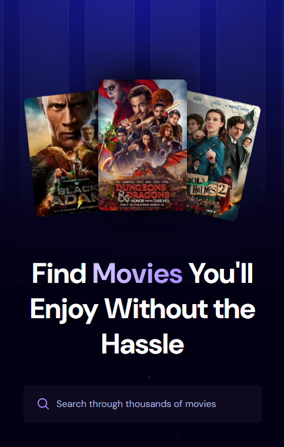

# Movie Search App 🎬

A movie search web app built with **React + Vite**, powered by the **TMDB API**.  
Users can search through thousands of movies, view key details, and track trending searches using **Appwrite**.

This project is originally inspired by a tutorial from **JavaScript Mastery (YouTube)**.  
Through building this app, I learned how to fetch external API data, manage search state efficiently, and optimize search-related interactions.

---

## Live Website

🔗 https://honeydew-pigeon-971328.hostingersite.com/

---

## Preview

  

---

## Features

- 🔍 Search movies from the TMDB database
- 🎞️ Display movie details:
  - Poster image
  - Title
  - Rating
  - Original language
  - Release year
- ⭐ Track popular search terms using Appwrite
- 🧠 Optimized search behavior with controlled inputs
- 🖼️ Graceful fallbacks for missing poster, rating, or release date

---

## Tech Stack

- **React**
- **Vite**
- **TMDB API**
- **Appwrite (Cloud Database)**
- **ESLint**

---

## Components Overview

### `Search`
- Controlled input component
- Updates `searchTerm` state as the user types
- Triggers search logic from the parent component

### `MovieCard`
- Displays individual movie data
- Shows:
  - poster image (with fallback)
  - movie title
  - vote average (formatted to 1 decimal)
  - original language
  - release year

### `updateSearchCount`
- Stores search popularity using Appwrite
- Logic:
  1. Check if the search term already exists
  2. If it exists → increment count
  3. If not → create a new document with movie metadata

---

## Appwrite Integration

This project uses **Appwrite Database** to store trending searches.

Each document contains:
- `searchTerm` – searched keyword
- `count` – number of times searched
- `movie_id` – TMDB movie ID
- `poster_url` – movie poster image URL

Search count logic:
- Uses `Query.equal()` to find an existing search term
- Updates the document if found
- Creates a new document if not found

---

## TMDB Image Handling

Movie posters are loaded using TMDB’s image CDN:

- If `poster_path` exists:
```

[https://image.tmdb.org/t/p/w500/{poster_path}](https://image.tmdb.org/t/p/w500/{poster_path})

````
- If not:
- A local fallback image (`/no-movie.png`) is displayed

---

## Environment Variables

Create a `.env` file in the project root and add:

```env
VITE_APPWRITE_PROJECT_ID=your_project_id
VITE_APPWRITE_DATABASE_ID=your_database_id
VITE_APPWRITE_TABLE_ID=your_table_id
VITE_TMDB_API_KEY=your_tmdb_api_key
````

⚠️ Make sure `.env` is included in `.gitignore`.

---

## Installation & Setup

### Clone the repository

```bash
git clone https://github.com/your-username/your-repo.git
cd your-repo
```

### Install dependencies

```bash
npm install
```

### Run the development server

```bash
npm run dev
```

---

## Available Scripts

```bash
npm run dev       # Start development server
npm run build     # Build for production
npm run preview   # Preview production build
npm run lint      # Run ESLint
```

---

## Dependencies

```json
{
  "react": "^19.1.1",
  "react-dom": "^19.1.1"
}
```

### Dev Dependencies

```json
{
  "@vitejs/plugin-react": "^5.0.4",
  "vite": "npm:rolldown-vite@7.1.14",
  "eslint": "^9.36.0",
  "eslint-plugin-react-hooks": "^5.2.0",
  "eslint-plugin-react-refresh": "^0.4.22"
}
```

---

## What I Learned

* Fetching and rendering API data in React
* Structuring reusable components
* Managing controlled inputs for search
* Optimizing search behavior
* Using Appwrite as a backend service
* Handling missing or partial API data gracefully

---

## Credits

* Original tutorial inspiration: **JavaScript Mastery (YouTube)**
* Movie data provided by: **TMDB API**
* Backend service: **Appwrite**

---

## License

This project is built for learning and portfolio purposes.
Please review TMDB and Appwrite terms before commercial use.

---

## 👤 Author

**Ria Choi**
💼 www.linkedin.com/in/ria-choi-76a658309
📧 riiachoii@gmail.com

If you like this project, consider ⭐ starring the repo!
